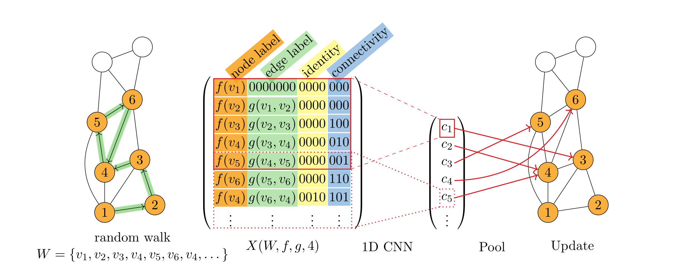
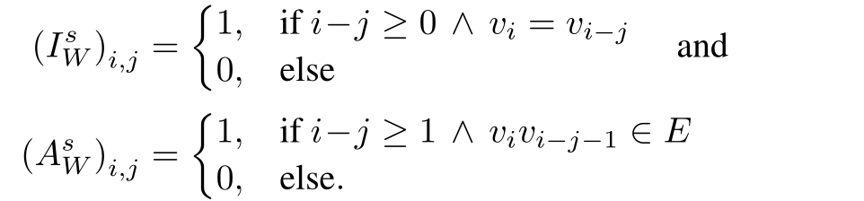
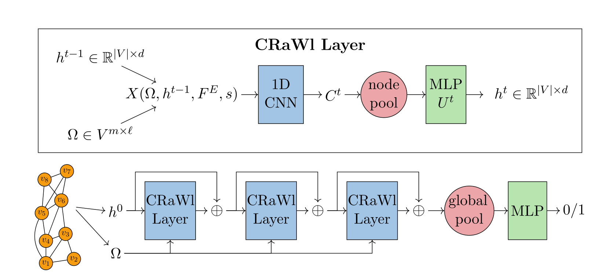

paper with code 挺吊，排名啥的挺有用

cnns for random walks，按他的说法，在图回归任务上很nb，先看看

## 算法原理

首先通过图上的随机游走获得节点序列，随后用卷积核对序列进行一维卷积，得到新的node embedding并更新

#### random walk

- uniform
- non-backtracking

#### 	walk features

node feature，edge feature，local identity relation，local adjacency realation

- I：表示子图中重复出现的点的结构信息，即随机游走循环周期，第s列为1表示s步之前也在这个点
- A：W序列中相邻的点必定相连，A表示不相邻的点之间的连接关系，不利用不在walk中的点的features，只是其存在性

m次长度为l的walk，形成张量X（*m x l x dx*），用于后续训练

#### crawl layer

## virtual node

创建一个和图中所有节点相连的虚拟节点，节点有其特殊的更新方式
allows global information flow after each layer
