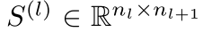
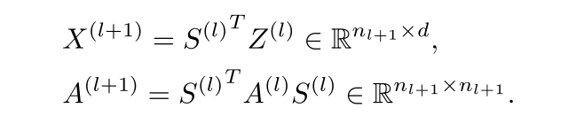
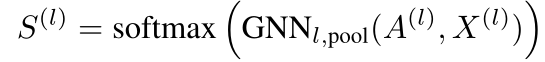
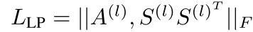
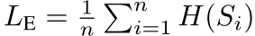

解决整张图的分类任务，应用在cost model上也许可以免去reduction的过程？

## 传统gnn的局限

- 通过边上信息的传播，即综合local structure得到node的embedding，但对于图分类任务，缺失整张图的粗略的层级结构的信息，所有的节点都被放在同一层进行处理，问题很大。
- 简单的sum或是基于集合操作的前馈神经网络，这种global pool的方式忽略了图中可能存在的层次结构

## 基本思想

- 参考卷积神经网络的卷积思想，即通过多层的卷积操作获得更加global的信息。反应在graph上即node embedding —> cluster —> node embedding 这样逐层进行，关键在于cluster的方式。
- learn a differentiable soft assignment at each layer， mapping nodes to a set of clusters based on their learned embeddings.
- **learn** an end to end hierarchical structure ranther than relying on a deterministic graph clustering subroutine

## Differentiable Pooling

- 最大的挑战：设计在不同结构的图中能够通用的pooling strategy

#### pooling with an assignment matrix

layer l:

注意到这里的邻接矩阵A带有边的权重信息

#### learning the assignment matrix S(l)

分别使用两个不同的gnn网络生成node embedding和assignment matrix

对S(l)的每一行进行softmax操作（左乘S）

在最后一层S为全一的向量，将所有的cluster聚合为一个节点。

#### how to train

实验证明仅仅利用梯度信息很难训练好pooling层；

在loss中加入：

代表临近的nodes会被分在同一cluster

代表S的每一行接近one-hot vector，即针对每一个节点，其属于哪一个cluster是清晰的

加入后模型需要更长的时间收敛，但训练的效果更好。

## 实验
蛋白质，社交网络，科学论文

enzymes:两个pooling层，graphsage，每个pooling层后节点数变为25%，sage后进行batchnorm，l2正则化可以增加model稳定性。

diffpool-det：using a deterministic graph clustering algorithm

diffpool-nolp：link prediction is turned off

#### dense & sparse subgraph structure

密集链接的子图更容易被划分为一个cluster，密集子图中的消息传递与结构信息能够有效地被gnn学习，稀疏的部分则不行，需要pooling层保留其结构信息。
