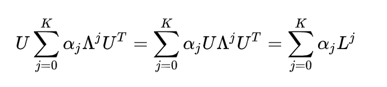

# spectral graph theory

## what is laplacian

借助于图的拉普拉斯矩阵（L = D - A，其中D为顶点的度矩阵（对角），A为邻接矩阵）的特征值和特征向量来研究图的性质；

注意到很多gcn理论用到了normalized Laplacian of graph ：I-D^(-1/2)AD^(-1/2)，即D^(-1/2)LD^(-1/2);

## why use it?

- 对称阵，可进行特征分解；
- 仅中心（对角线）与1-hopneighbor处为非零；

## Fourier on graph

U可看作卡普拉斯算子L的特征函数（广义）；

则graph上的n维向量的广义傅里叶变换可表示为：

则由傅里叶变换可以定义graph上的卷积，即变换域相乘：

## graph convolution in deep learning 

### 第一代gcn

与矩阵上述基本原理基本相同，其实际应用中的缺点在在于：

- 矩阵乘法过多，O(n^3)
- saptial localization?
- 卷积核需要n个参数

### 第二代

将卷积核的参数用特征向量的线性组合来表示。

- 卷积核K个参数，复杂度性降低
- 无需特征分解，直接利用L
- spatial localization，规定K后，卷积操作将中心顶点K-hop neighbor的feature进行加权求和

> 另有chebyshev多项式作为卷积核

## local connectivity & parameter sharing

## 缺点

- 假设图是无向的
- 不能处理动态图
- 不能为每个邻居分配不同的权重

## graph attention network（GAT）