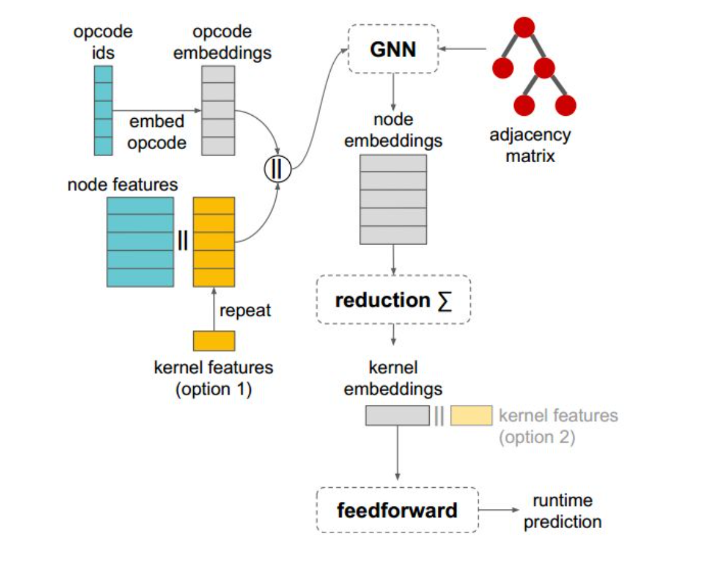
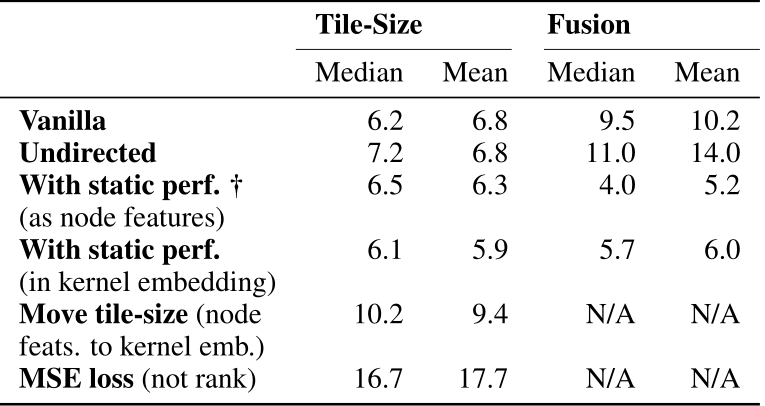
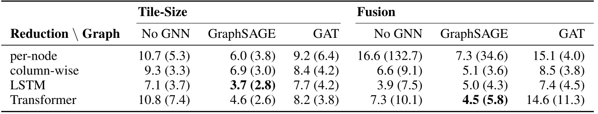
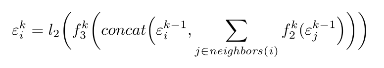
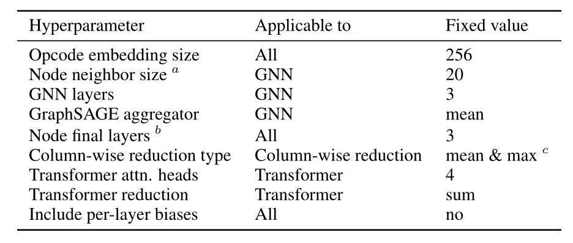

# model ablation studies 

通过去除A模块来考察其在模型中的具体作用

### graph features & loss function

统一使用graphsage，per-node reduction(计算每个node embedding通过一个前馈神经网络得到的结果的和)

- edge direction：在操作融合任务中可提供3.8%的平均错误率减少，tile-size任务中无关
- static performance features: kernel features from xla compiler including : 1.number of floating point operations; 2.amount of data read in bytes; 3.amount of data being written in bytes; 4.number of instructions executing on a spectial functional unit.

		fusion : 5%; tile-size: much less.

 

### neural network model

- graph or sequences：讲了一下graphsage的不可或缺，纯粹的sequences模型用lstm在fusion的平均偏差很好，但标准差太大（不同程序之间的鲁棒性不太行），别的工作就更差了。
- reduction：考虑到一般的gnn只能综合中心节点k-hop之内的信息，利用LSTM和Transformer将node embeddings综合为kernel embeddings，（graphsage-transformer占据训练速度上的优势）；值得注意的是，简单的column-wise reduction也有很好的效果，且推断速度上有优势。
- gnn的选择：每层多个attention heads的GAT & graphsage。GAT的训练对参数的选择更加敏感

# xla toolchain intergration

将得到的cost model添加到xla的编译器与autotuner中去。

比较在一定时间限制内运行cost model，仅使用hw，以及找到的最好编译方式的运行时间。

cost model+hw能够在较短时间内接近最优的编译方式。

# tpu

通用的矩阵乘法单元

- High Bandwidth Memory(HBM)

垂直堆叠的DRAM核心

- 高速的片上暂时存储

大小受限，分割tile-size（tile-size selection）

- 融合基础的计算操作（operator fusion）

减少对HBM的访问

# graphsage in this article

f：feedforward layer；

l2：L2 normalization；

\sum：通过超参数选择确定的聚合函数（or reduction）似乎最终的选择也没提到？（hyperparameter，哪种最好应该能自己试出来）

超参数的选择竟然藏在附录里。。

 

# 我不是很懂的LSTM & transformer encoder

### lstm

long short-term memory

看了原理还是有点模糊，似乎就是在rnn的基础上加了一个控制忘记还是记住的参数模块。

### transformer encoder

 

# 模型超参数

nn.MultiLabelMarginLoss
